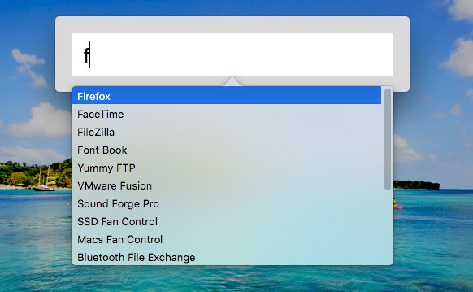

# cutecmd-mac
Programmer's command runner in macOS, like Alfred/QuickSilver, but with below different:

- **Script First**: first match your [Apple Script](https://developer.apple.com/library/content/documentation/AppleScript/Conceptual/AppleScriptLangGuide/introduction/ASLR_intro.html), then fallback to system app.

- **No Ranking**: All command matchs don't use ranking, but [fuzzy matched](https://github.com/yichizhang/StringScore_Swift), this means all input have definite output, no trainning, no try.

- **Highly Customized**: It's simple and basic, using **Swift 3**, you can add any function to fit your needs.

- **keyUp Event**: using **keyUp** rather than keydown, you can regret your mind, by delay release your keyboard, to prevent abruptness. That's important when you're using **Emacs** or **Vim** like editors.

## Usage

1. Download **cutecmd.app.zip** from [Lastest Release](https://github.com/futurist/cutecmd-mac/releases/latest), or build from source.

2. Unzip, copy **cutecmd.app** into **Applications** folder.

3. Run **cutecmd.app**, **Press CTRL+CTRL** to activate input window.

4. Input, then hit **SPACE** (for input text) or **TAB** (for list selection) to launch.

## Launch Order

1. Try to launch exact same name with AppleScript file (without extension) from **User Script Folder**, if not found, try next.

2. Try to launch with command line **open [input text]**, that for **Path** and **URL**, if command failed, try next.

3. Try to launch with command line **open -a [input text]**, that for **Application** in `/Applications` folder, if failed, try next.

## How To Hide

- When input window lost focus

- When press <kbd>ESC</kbd>

- When press <kbd>CTRL-G</kbd> (same as Emacs `(keyboard-quit)`)

- When a command run successfully

## Command List

### <kbd>:quit</kbd>
> Quit cutecmd, <kbd>Command + Q</kbd> won't quit this app.

### <kbd>:setup</kdb>
> Open user's script folder, and copy/add AppleScript there.

[Scripts](Scripts) folder have some pre-defined scripts, just copy them to **User Script Folder** to try.

### <kbd>:reload</kdb>
> Reload /Applications folder to refresh app list.

### <kbd>any char</kbd>
> Any char to exact match AppleScript first, if no file with input name there, fallback to fuzzy matched application.

## Libs Used

- [AutoCompleteTextField](https://github.com/fancymax/AutoCompleteTextField), by @fancymax

- [StringScore_Swift](https://github.com/yichizhang/StringScore_Swift), by @yichizhang

## Windows Version

[cutecmd-win](https://github.com/futurist/cutecmd)

## License

MIT @ [James Yang](https://github.com/futurist/)

